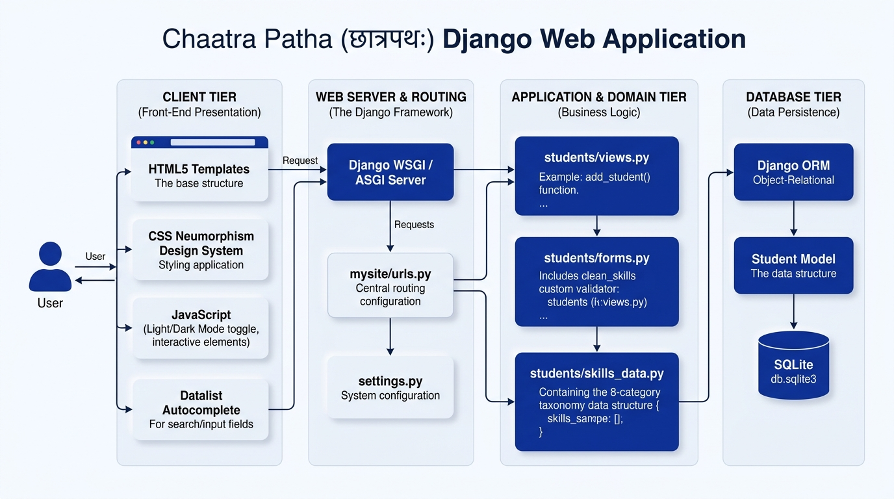
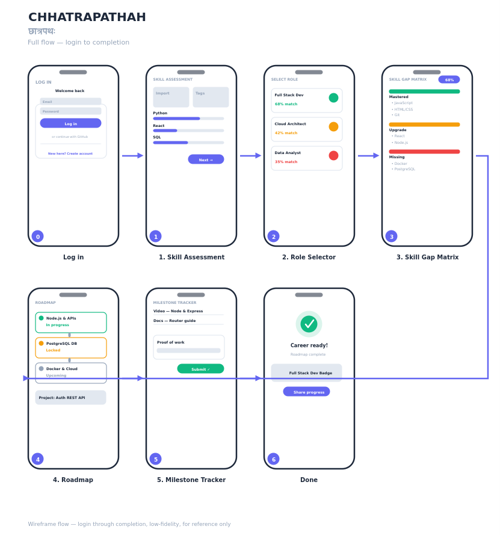

# Chaatra-Patha

> A platform to bridge the gap between a student's current skills and their chosen career path.

## 📖 Overview

Chaatra-Patha is a platform designed to compare a student's current skills against the requirements of a selected career path to generate a practical, actionable learning roadmap. The goal is to help students clearly understand exactly what they need to learn next in order to progress toward their desired careers.

## 🏗 System Architecture

The following diagram outlines the system architecture for the Chaatra-Patha Django web application, detailing the flow from the client tier through the web server, application logic, and down to the database tier:

## 🚀 Project Status

**Phase: Initial Scaffolding / Early-Stage Development**

The repository currently contains standard Django project scaffolding. The core application logic, models, views, and templates are in the planning phases and will be added as development continues.

## 🛠 Technology Stack

* **Framework:** [Django](https://www.djangoproject.com/) (High-level Python web framework)
* **Language:** Python
* **Database:** SQLite (Currently configured for local development)
* **Frontend:** HTML5, CSS (Neumorphism Design System), JavaScript

## 📂 Repository Contents

| File | Purpose | 
| ----- | ----- | 
| `manage.py` | Django's command-line utility for administrative tasks (e.g., running the development server, making migrations). | 
| `README.md` | Project description, summary, and documentation. | 
| `.gitignore` | Specifies files and directories excluded from version control (e.g., `venv/`, `__pycache__/`, `db.sqlite3`, and IDE configs). | 
| `LICENSE.txt` | Project license details. | 

## 🎨 Application Wireframes

The diagram below illustrates the intended user flow for the application, from login through the completion of the career roadmap:

*Figure 1: Full flow — login through completion (low-fidelity wireframe, for reference only)*

## 📄 License

This project is released under the **MIT License** (2026).

The MIT License is a permissive open-source license that allows anyone to use, copy, modify, merge, publish, distribute, sublicense, and sell copies of the software, provided that the original copyright notice and license text are included in any copies or substantial portions of the software.

*This README will be continuously updated as new features, architectural details, and implementation steps are added to the repository.*